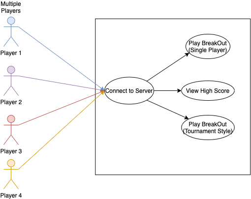

# MULTIPLAYER TOURNAMENT BREAKOUT

## Project Abstract
The project that I am proposing is the creation of a multiplayer tournament-style version of the classic Breakout game, most notably found in arcades and on older iterations of iPod Nanos and other handheld devices. Traditionally, BreakOut is a single-player game in which the user uses a paddle to bounce a ball and destroy bricks on the opposing side without allowing the ball to disappear from the screen. From a previous class, I have a single-player version of Breakout availble that was developed in Java. I would like to propose creating a multi-player version in which users are able to play against friends in a tournament-style manner. For example, if there are four players involved, they will be paired up and will compete against each other within the pair. The player with the highest Breakout score in the pair will be considered the winner and will play against the winner of the other pair. The winner of this final round would be considered to be the champion of the Breakout tournament. All players will be able to see their scores on the Scoreboard, which keeps track of the highest scores in the game, just like in an arcade.

## Project Relevance
My proposal is linked very intricately with the educational goals of our CIS3296 class. Firstly, this project will require a great deal of test driven development, object-oriented design, and graphic user interfaces. The graphic interface will need to be altered in order to allow multiple people to play against each other, which will require networks and sockets. This fits nicely with the first goal, which is to introduce students to a variety of topics, such as the ones mentioned previously, and demonstrate their practical application. This is an important goal because it will prepare students as they enter jobs that require understanding and using such concepts in software development. To continue, this project will require the use of version control, project management, and ample testing to ensure that we can keep track of issues and work effectively as a team. This is relevant to the second educational goal, which is to provide practical experience in using moden software development tools. This goal is important because in our future careers we will need to be able to share code with others and test our code effectively in a professional setting. While this project does not modify an existing open source project (Educational Goal 3), it does provide an opportunity for students to work in small teams which will be help us develop skills in communication and time management. Eventually, this project will be submitted as an open-source project.

## Conceptual Design
My proposed contribution to this project is the creation of the multiplayer functionality for this game as well as a class ScoreBoard that will track high scores. This will be implemented using a user interface. To create multiplayer functionality, we would have to develop code for a server and clients, such that there is one client per player. The clients would connect to the server and the server would then randomly decide the tournament brackets and organize the games. The scores of the players would be updated at the end of each round and put in an arraylist. At the end of the game, players would see their scores with their usernames in descending order, ideally using some sort of user interface. The scores from previous games would have to be maintained in this ScoreBoard as well if the players choose to keep playing another game.

## Background
URL reference to project: https://github.com/Priya-Nigam/IndividualProjectProposal/tree/master/breakout

To successfully build and run the project, git clone the repository in your Java IDE. Then build the project and run the Breakout.java configuration. This should load a GUI in which clicking will start the single player version of the game.

***Building***
- Works with Intellij IDEA 2020.2.1 Community version on Mac OS. 
- Select src, ignore bin. 
- Click on Build Project
- May give you an error that main class does not exist. Make sure that there is a main with the line "new Breakout().start(args);".
- If you are having trouble implementing the GUI program, make sure acm.jar is selected as a library by going in project structure >> library. If necessary, you can redownload the acm.jar from this website: https://cs.stanford.edu/people/eroberts/jtf/

**Running** 
- Select Breakout.java for normal Breakout Game.
- BreakoutExtra.java can also be used and has additional graphical features. 

## Required Resources
- Group members should have some familiarity with sockets/clients, Java, and GUI. 
- IntelliJ IDEA use as the Java IDE would be ideal. 
